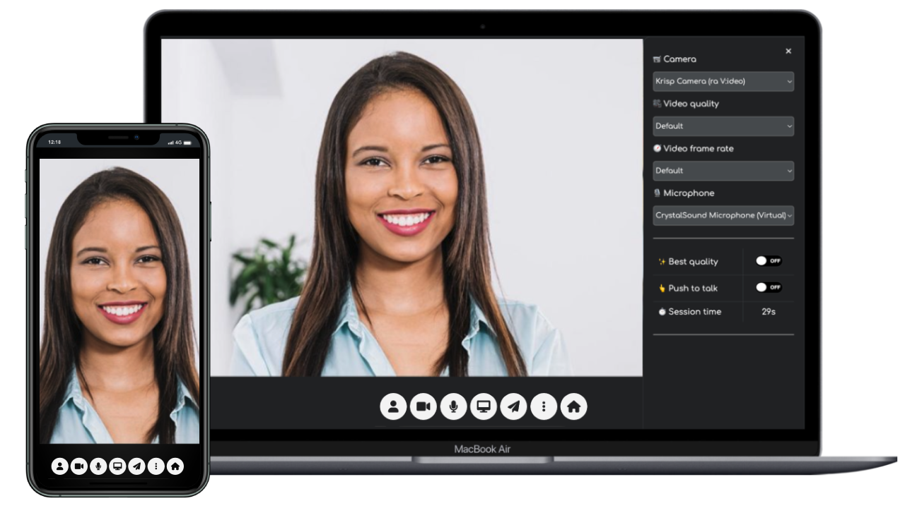

<h1 align="center">MiroTalk C2C</h1>

<br />

<div align="center">

<a href="https://www.linkedin.com/in/miroslav-pejic-976a07101/"></a>
<a href="https://choosealicense.com/licenses/agpl-3.0/"></a>
<a href="https://codecanyon.net/item/mirotalk-c2c-webrtc-real-time-cam-2-cam-video-conferences-and-screen-sharing/43383005"></a>
<a href="https://codecanyon.net/item/mirotalk-c2c-webrtc-real-time-cam-2-cam-video-conferences-and-screen-sharing/43383005"></a>
<a href="https://discord.gg/rgGYfeYW3N"></a>

</div>

<p align="center">Free WebRTC Real-Time Cam-2-Cam Video Calls & Screen Sharing, End-to-End Encrypted, to embed in any website with a <a href="https://github.com/miroslavpejic85/mirotalkc2c/issues/2#issuecomment-1340587150" target="_blank">simple iframe.</a></p>

<hr />

<p align="center">
    <a href="https://c2c.mirotalk.com">Explore MiroTalk C2C</a>
</p>

<hr />

<p align="center">
    <a href="https://c2c.mirotalk.com"></a>
</p>

<hr />

<strong>
    <p align="center">
        Join our Community for questions, help, support, ideas, and discussions on <a href='https://discord.gg/rgGYfeYW3N'>Discord</a>
    </p>
</strong>

<hr />

<details open>
<summary>Quick start</summary>


Install [NodeJs](https://nodejs.org/en/blog/release/v18.16.0).

```bash
# Clone the project repo
$ git clone https://github.com/miroslavpejic85/mirotalkc2c.git
# Go to project dir
$ cd mirotalkc2c
# Copy .env.template in .env and edit it if needed
$ cp .env.template .env
# Install dependencies
$ npm install
# Start the server
$ npm start
```

Open [http://localhost:8080](http://localhost:8080) in your browser.

</details>

<details open>
<summary>Docker</summary>

<br/>


Repository: [Docker hub](https://hub.docker.com/r/mirotalk/c2c)

Install [docker](https://docs.docker.com/engine/install/) and [docker-compose](https://docs.docker.com/compose/install/).

```bash
# Clone the project repo
$ git clone https://github.com/miroslavpejic85/mirotalkc2c.git
# Go to project dir
$ cd mirotalkc2c
# Copy .env.template in .env and edit it if needed
$ cp .env.template .env
# Copy docker-compose.template.yml in docker-compose.yml and edit it if needed
$ cp docker-compose.template.yml docker-compose.yml
# Get official image from Docker Hub
$ docker pull mirotalk/c2c:latest
# Create and start containers
$ docker-compose up
```

Open [http://localhost:8080](http://localhost:8080) in your browser.

</details>

<details>
<summary>Documentations</summary>

<br>

- `Ngrok/HTTPS:` You can start a video conference directly from your local PC and make it accessible from any device outside your network by following [these instructions](docs/ngrok.md), or expose it directly on [HTTPS](backend/ssl/README.md).

- `Stun/Turn:` Install your own [Stun & Turn](https://docs.mirotalk.com/coturn/stun-turn/) by following [this instructions](./docs/coturn.md).

- `Self-hosting:` For `self-hosting MiroTalk C2C` on your own dedicated server, please refer to [this comprehensive guide](docs/self-hosting.md). It will provide you with all the necessary instructions to get your MiroTalk C2C instance up and running smoothly.

- `Rest API:` The [API documentation](https://docs.mirotalk.com/mirotalk-c2c/api/) uses [swagger](https://swagger.io/) at http://localhost:8080/api/v1/docs or check it on live [here](https://c2c.mirotalk.com/api/v1/docs).

    ```bash
    # The response will give you a entrypoint / Room URL for your meeting.
    $ curl -X POST "http://localhost:8080/api/v1/meeting" -H "authorization: mirotalkc2c_default_secret" -H "Content-Type: application/json"
    $ curl -X POST "https://c2c.mirotalk.com/api/v1/meeting" -H "authorization: mirotalkc2c_default_secret" -H "Content-Type: application/json"
    # The response will give you a entrypoint / URL for the direct join to the meeting.
    $ curl -X POST "http://localhost:8080/api/v1/join" -H "authorization: mirotalkc2c_default_secret" -H "Content-Type: application/json" --data '{"room":"test","name":"mirotalkc2c"}'
    $ curl -X POST "https://c2c.mirotalk.com/api/v1/join" -H "authorization: mirotalkc2c_default_secret" -H "Content-Type: application/json" --data '{"room":"test","name":"mirotalkc2c"}'
    ```

</details>

<details open>
<summary>Hetzner & Contabo</summary>

<br/>

[](https://hetzner.cloud/?ref=XdRifCzCK3bn)

This application is running for `demonstration purposes` on [Hetzner](https://www.hetzner.com/), one of `the best` [cloud providers](https://www.hetzner.com/cloud) and [dedicated root servers](https://www.hetzner.com/dedicated-rootserver).

---

Use [my personal link](https://hetzner.cloud/?ref=XdRifCzCK3bn) to receive `€⁠20 IN CLOUD CREDITS`.

---

[](https://www.dpbolvw.net/click-101027391-14462707)

Experience also top-tier German web hosting – dedicated servers, VPS, and web hosting at `unbeatable prices`. Reliable, secure, and backed by 24/7 support. [Explore now here](https://www.dpbolvw.net/click-101027391-14462707)

---

To set up your own instance of `MiroTalk C2C` on a dedicated cloud server, please refer to our comprehensive [self-hosting documentation](https://docs.mirotalk.com/mirotalk-c2c/self-hosting/). This guide will walk you through the process step by step, ensuring a smooth and successful deployment.

</details>

<details open>
<summary>Support</summary>

<br/>

Do you find MiroTalk C2C indispensable for your needs? Join us in supporting this transformative project by [becoming a backer or sponsor](https://github.com/sponsors/miroslavpejic85). By doing so, not only will your logo prominently feature here, but you'll also drive the growth and sustainability of MiroTalk C2C. Your support is vital in ensuring that this valuable platform continues to thrive and remain accessible for all. Make an impact – back MiroTalk C2C today and be part of this exciting journey!

</details>

<details>
<summary>License</summary>

<br/>


MiroTalk C2C is free and open-source under the terms of AGPLv3 (GNU Affero General Public License v3.0). Please `respect the license conditions`, In particular `modifications need to be free as well and made available to the public`. Get a quick overview of the license at [Choose an open source license](https://choosealicense.com/licenses/agpl-3.0/).

To obtain a [MiroTalk C2C license](https://docs.mirotalk.com/license/licensing-options/) with terms different from the AGPLv3, you can conveniently make your [purchase on CodeCanyon](https://codecanyon.net/item/mirotalk-c2c-webrtc-real-time-cam-2-cam-video-conferences-and-screen-sharing/43383005). This allows you to tailor the licensing conditions to better suit your specific requirements.

</details>

## Diving into Additional MiroTalk Projects:

<details>
<summary>MiroTalk SFU</summary>

<br>

Try also [MiroTalk SFU](https://github.com/miroslavpejic85/mirotalksfu) `selective forwarding unit` real-time video conferences, optimized for large groups. `Unlimited time, unlimited concurrent rooms` each having 8+ participants, up to ~ 100 per single CPU.

</details>

<details>
<summary>MiroTalk P2P</summary>

<br/>

Try also [MiroTalk P2P](https://github.com/miroslavpejic85/mirotalk) `peer to peer` real-time video conferences, optimized for small groups. `Unlimited time, unlimited concurrent rooms` each having 5-8 participants.

</details>

<details>
<summary>MiroTalk BRO</summary>

<br>

Try also [MiroTalk BRO](https://github.com/miroslavpejic85/mirotalkbro) `Live broadcast` (peer to peer) live video, audio and screen stream to all connected users (viewers). `Unlimited time, unlimited concurrent rooms` each having a broadcast and many viewers.

</details>

<details>
<summary>MiroTalk WEB</summary>

<br>

Try also [MiroTalk WEB](https://github.com/miroslavpejic85/mirotalkwebrtc) a platform that allows for the management of an `unlimited number of users`. Each user must register with their email, username, and password, after which they gain access to their `personal dashboard`. Within the dashboard, users can `manage their rooms and schedule meetings` using the desired version of MiroTalk on a specified date and time. Invitations to these meetings can be sent via email, shared through the web browser, or sent via SMS.

</details>

---
