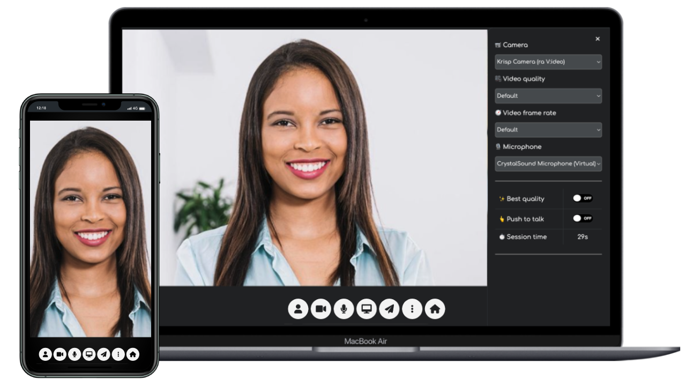

<h1 align="center">MiroTalk C2C</h1>

<h3 align="center">WebRTC peer-to-peer video calls and screen sharing with end-to-end encryption, easily embeddable in any website via iframe</h3>

<br />

<div align="center">

[](https://github.com/miroslavpejic85/mirotalkc2c/stargazers)
[](https://github.com/miroslavpejic85/mirotalkc2c/network/members)

<a href="https://choosealicense.com/licenses/agpl-3.0/"></a>
<a href="https://hub.docker.com/r/mirotalk/c2c"></a>
<a href="https://github.com/miroslavpejic85/mirotalkc2c/commits/master"></a>
<a href="https://discord.gg/rgGYfeYW3N"></a>
<a href="https://www.linkedin.com/in/miroslav-pejic-976a07101/"></a>

</div>

<br />

<p align="center"><strong>MiroTalk C2C</strong> is a <strong>self-hosted, open-source</strong> platform for <strong>real-time cam-2-cam video calls and screen sharing</strong> using direct <strong>peer-to-peer WebRTC connections</strong>. End-to-end encrypted, embeddable in any website with a <a href="https://docs.mirotalk.com/mirotalk-c2c/integration/" target="_blank">simple iframe</a>.</p>

<p align="center">
    <a href="https://c2c.mirotalk.com"></a>
    &nbsp;
    <a href="https://docs.mirotalk.com/mirotalk-c2c/self-hosting/"></a>
    &nbsp;
    <a href="https://discord.gg/rgGYfeYW3N"></a>
    &nbsp;
    <a href="https://github.com/sponsors/miroslavpejic85"></a>
</p>

<br />

<p align="center">
    <a href="https://c2c.mirotalk.com">
        
    </a>
</p>

<hr />

<br />

<details open>
<summary>⚡ Quick start</summary>

<br/>

**Start in 5 commands:**

```bash
git clone https://github.com/miroslavpejic85/mirotalkc2c.git
cd mirotalkc2c
cp .env.template .env
npm install
npm start
```

Open [http://localhost:8080](http://localhost:8080) - done!

</details>

<details>
<summary>🐳 Docker</summary>

<br/>


**Prerequisites:** Install [Docker Engine](https://docs.docker.com/engine/install/) and [Docker Compose](https://docs.docker.com/compose/install/) - Image available on [Docker Hub](https://hub.docker.com/r/mirotalk/c2c)

```bash
git clone https://github.com/miroslavpejic85/mirotalkc2c.git
cd mirotalkc2c
cp .env.template .env
cp docker-compose.template.yml docker-compose.yml
docker-compose pull    # optional: pull official image
docker-compose up      # add -d to run in background
```

Open [http://localhost:8080](http://localhost:8080) - done!

> **Note:**
> Edit `.env` and `docker-compose.yml` to customize your setup.

</details>

<details>
<summary>📚 Documentation</summary>

<br/>

For detailed guides and references, visit the **[official documentation](https://docs.mirotalk.com)**:

- [About](https://docs.mirotalk.com/mirotalk-c2c/)
- [Self-Hosting Guide](https://docs.mirotalk.com/mirotalk-c2c/self-hosting/)
- [Automation-scripts](https://docs.mirotalk.com/scripts/about/)
- [Configurations](https://docs.mirotalk.com/mirotalk-c2c/configurations/)
- [Integration](https://docs.mirotalk.com/mirotalk-c2c/integration/)
- [Direct Room Join](https://docs.mirotalk.com/mirotalk-c2c/join-room/)
- [REST API Documentation](https://docs.mirotalk.com/mirotalk-c2c/api/)
- [Ngrok](https://docs.mirotalk.com/mirotalk-c2c/ngrok/)

</details>

<details open>
<summary>☁️ Recommended Hosting Providers</summary>

<br/>

| Provider                                                                                       | Description                                                                                                    | Link                                                                |
| ---------------------------------------------------------------------------------------------- | -------------------------------------------------------------------------------------------------------------- | ------------------------------------------------------------------- |
| [](https://www.hetzner.com)                             | High-performance cloud servers and dedicated root servers with top-tier reliability. Powers our live demo.      | [Get €20 Free Credits](https://hetzner.cloud/?ref=XdRifCzCK3bn)     |
| [](https://www.netcup.com/en/?ref=309627)                 | Enterprise-grade performance at unbeatable prices. Scalable and reliable.                                      | [Explore Netcup](https://www.netcup.com/en/?ref=309627)             |
| [](https://hostinger.com/?REFERRALCODE=MIROTALK)    | Fast, reliable hosting with 24/7 support and great performance.                                                | [Check out Hostinger](https://hostinger.com/?REFERRALCODE=MIROTALK) |
| [](https://www.dpbolvw.net/click-101027391-14462707)    | Top-tier German hosting, dedicated servers, VPS, and web hosting at unbeatable prices.                         | [Explore Contabo](https://www.dpbolvw.net/click-101027391-14462707) |

To set up your own instance of `MiroTalk C2C` on a dedicated cloud server, please refer to our comprehensive [self-hosting documentation](https://docs.mirotalk.com/mirotalk-c2c/self-hosting/).

</details>

<details>
<summary>🤝 Contributing</summary>

<br/>

Contributions are welcome and greatly appreciated! Whether it's bug fixes, features, or documentation - every contribution helps.

1. Fork the repository
2. Create your feature branch
3. Submit a pull request

Have questions? Join our [Discord community](https://discord.gg/rgGYfeYW3N)!

</details>

<details>
<summary>📄 License</summary>

<br/>

[](LICENSE)

MiroTalk C2C is free and open-source under the terms of AGPLv3 (GNU Affero General Public License v3.0). Please `respect the license conditions`, In particular `modifications need to be free as well and made available to the public`. Get a quick overview of the license at [Choose an open source license](https://choosealicense.com/licenses/agpl-3.0/).

To obtain a [MiroTalk C2C license](https://docs.mirotalk.com/license/licensing-options/) with terms different from the AGPLv3, you can conveniently make your [purchase on CodeCanyon](https://codecanyon.net/item/mirotalk-c2c-webrtc-real-time-cam-2-cam-video-conferences-and-screen-sharing/43383005). This allows you to tailor the licensing conditions to better suit your specific requirements.

</details>

<details open>
<summary>Support the project</summary>

<br/>

Do you find MiroTalk C2C indispensable for your needs? Join us in supporting this transformative project by [becoming a backer or sponsor](https://github.com/sponsors/miroslavpejic85). By doing so, not only will your logo prominently feature here, but you'll also drive the growth and sustainability of MiroTalk C2C. Your support is vital in ensuring that this valuable platform continues to thrive and remain accessible for all. Make an impact – back MiroTalk C2C today and be part of this exciting journey!

</details>

<br />

---

🌐 **Explore all MiroTalk projects:** [MiroTalk Overview →](https://docs.mirotalk.com/overview/)

---

## Star History

If you like this project, please star it - every star helps more people discover this project!

[](https://star-history.com/#miroslavpejic85/mirotalkc2c&Date)

---

<p align="center">
  Built with ❤️ by <a href="https://www.linkedin.com/in/miroslav-pejic-976a07101/">Miroslav</a> and the open-source community
</p>
